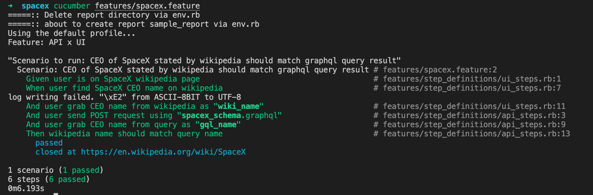

# Ironman
An automated test to check whether the CEO of SpaceX stated by Wikipedia is similar to the one acquired from [SpaceX Land](https://spacex.land/) GraphQL API using Selenium WebDriver.


## Prerequisite
Ruby 2.6.0

## How to Run
Clone the project

```bash
  git clone https://github.com/nabilasiregar/spacex-graphql
```

Go to the project directory

```bash
  cd spacex-graphql
```

Install dependencies

```bash
  bundle install
```

Copy sample env file

```bash
  cp .env.sample .env
```
Through dotenv file, we can switch between headless and non-headless mode. Simply comment out which mode you do not wish to use.

Run the test

```bash
  cucumber features/spacex.feature
```
### Result

